<h1 align="center">🚀 End-to-End DevOps CI/CD Pipeline on AWS EKS</h1><p align="center">
Production-Grade DevOps Project with Jenkins • SonarQube • Trivy • Docker • Kubernetes • Prometheus • Grafana
</p><p align="center">


</p>

---

📌 Overview

This project demonstrates a Production-Grade End-to-End DevOps CI/CD Pipeline deployed on AWS using EKS.

The pipeline automatically:

- Builds the application
- Runs code quality checks
- Performs security scanning
- Builds Docker image
- Pushes to DockerHub
- Deploys to Kubernetes (EKS)
- Monitors using Prometheus & Grafana

This project simulates a real-world enterprise DevOps architecture.

---

🧠 Architecture

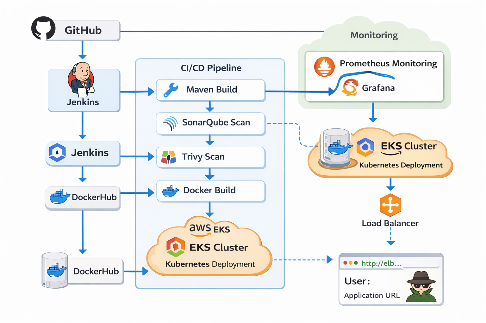

```
                        +-------------+
                        | Developer   |
                        +------+------+
                               |
                               v
                        +-------------+
                        |   GitHub    |
                        +------+------+
                               |
                               v
                        +-------------+
                        |   Jenkins   |
                        +------+------+
                               |
               +---------------+----------------+
               |                                |
               v                                v
        +--------------+                +--------------+
        |  SonarQube   |                |    Trivy     |
        +------+-------+                +------+-------+
               |                               |
               +---------------+---------------+
                               |
                               v
                        +-------------+
                        |   Maven     |
                        +------+------+
                               |
                               v
                        +-------------+
                        |   Docker    |
                        +------+------+
                               |
                               v
                        +-------------+
                        |    Nexus    |
                        +------+------+
                               |
                               v
                        +-------------+
                        |     EKS     |
                        +------+------+
                               |
                               v
                +--------------+--------------+
                |                             |
                v                             v
        +---------------+             +--------------+
        |  Prometheus   |             |   Grafana    |
        +---------------+             +--------------+

```

Flow:

GitHub → Jenkins → Maven → SonarQube → Trivy → Docker → DockerHub → EKS → LoadBalancer → User
↓
Prometheus + Grafana

---

## ⚙️ Tech Stack

| Category        | Tools               |
| --------------- | ------------------- |
| Cloud           | AWS EC2, AWS EKS    |
| CI/CD           | Jenkins             |
| Build           | Maven               |
| Code Quality    | SonarQube           |
| Security        | Trivy               |
| Container       | Docker              |
| Registry        | DockerHub           |
| Orchestration   | Kubernetes          |
| Monitoring      | Prometheus, Grafana |
| Package Manager | Helm                |

---

🔁 CI/CD Pipeline

Jenkins Pipeline Stages

1. Git Checkout
2. Compile
3. Test
4. Trivy File Scan
5. SonarQube Analysis
6. Quality Gate
7. Package
8. Docker Build
9. Docker Push
10. Container Deployment

---

☁️ AWS Infrastructure

- EC2 → Jenkins / Sonar / Nexus / Monitoring
- EKS Cluster
- Managed NodeGroup
- LoadBalancer Service
- Security Groups
- IAM Roles

---

🐳 Docker Image

faizanab/mission:latest

DockerHub: https://hub.docker.com/r/faizanab/mission

---

📊 Monitoring

Installed using Helm

helm install monitoring prometheus-community/kube-prometheus-stack -n monitoring

Dashboards:

- Node Exporter / Nodes
- Kubernetes / Workload
- Namespace Workload
- Prometheus Overview

---

📂 Project Structure

.
├── Jenkinsfile
├── Dockerfile
├── k8s/
├── docs/
│   └── architecture.png
├── screenshots/
│   ├── jenkins.png
│   ├── sonar.png
│   ├── trivy.png
│   ├── dockerhub.png
│   ├── grafana.png
│   ├── eks.png
│   ├── app.png
│   └── nexus.png
└── README.md

---

📸 Screenshots

Jenkins Pipeline

Development Deployment 

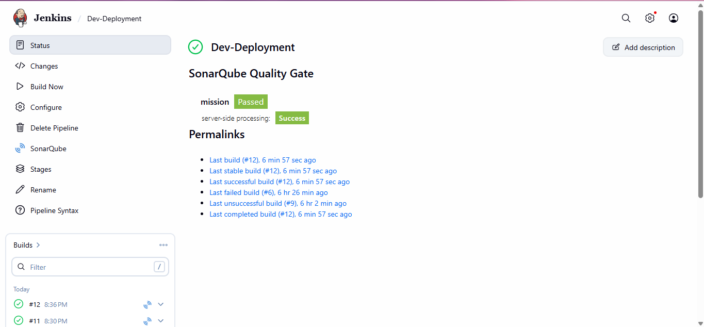

Production Deployment

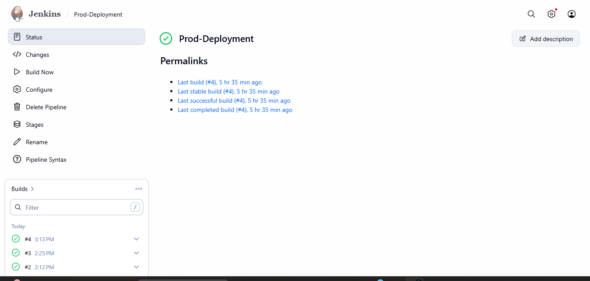

SonarQube

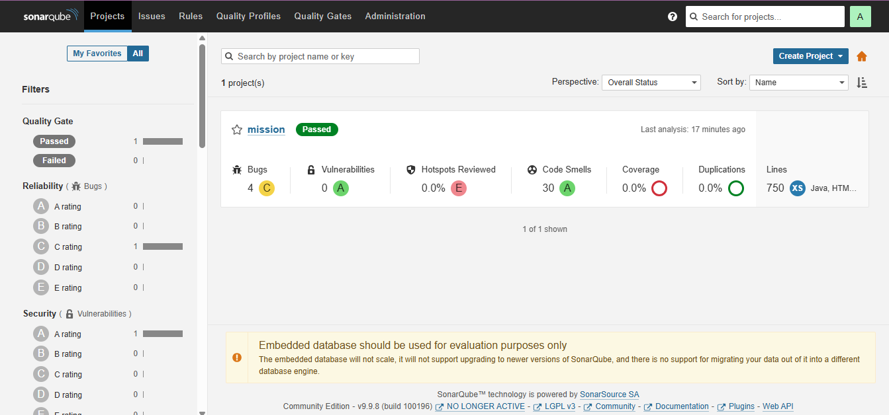

DockerHub

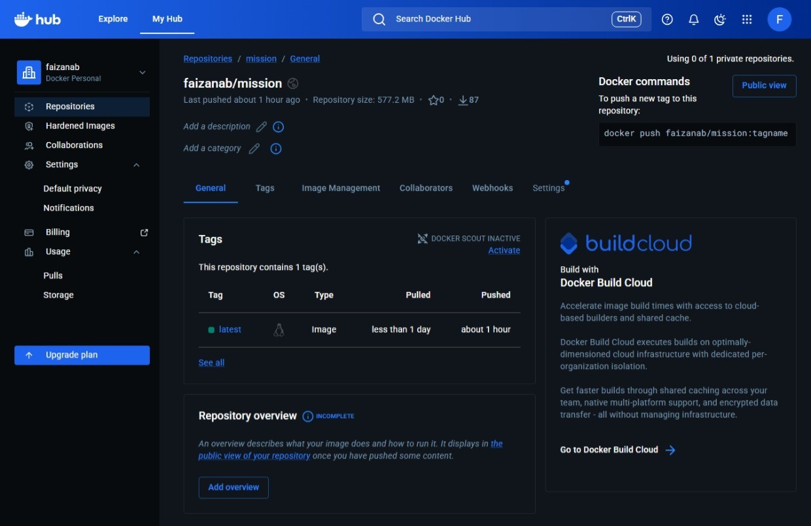

EKS Nodes

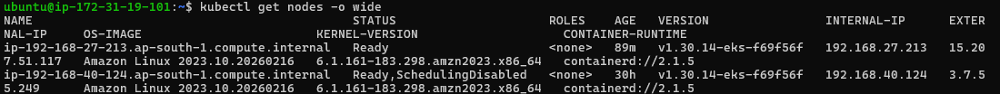

Kubernetes Pods

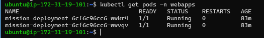

LoadBalancer Service

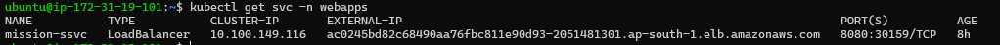

Grafana

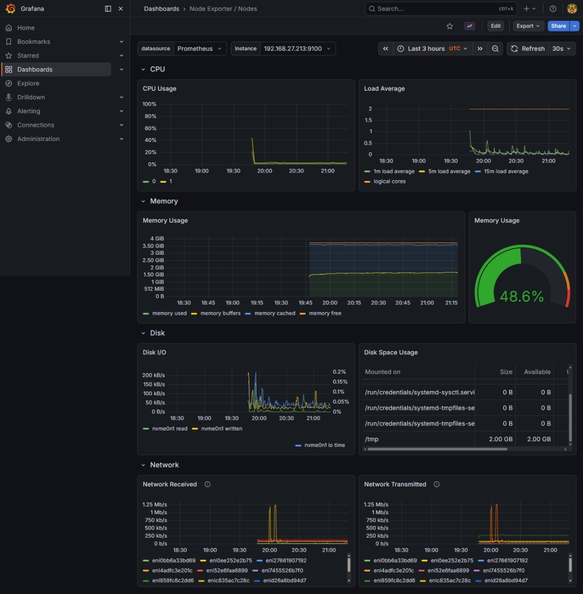

Grafana Workload

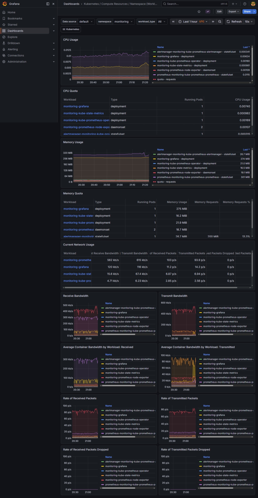

Application Running

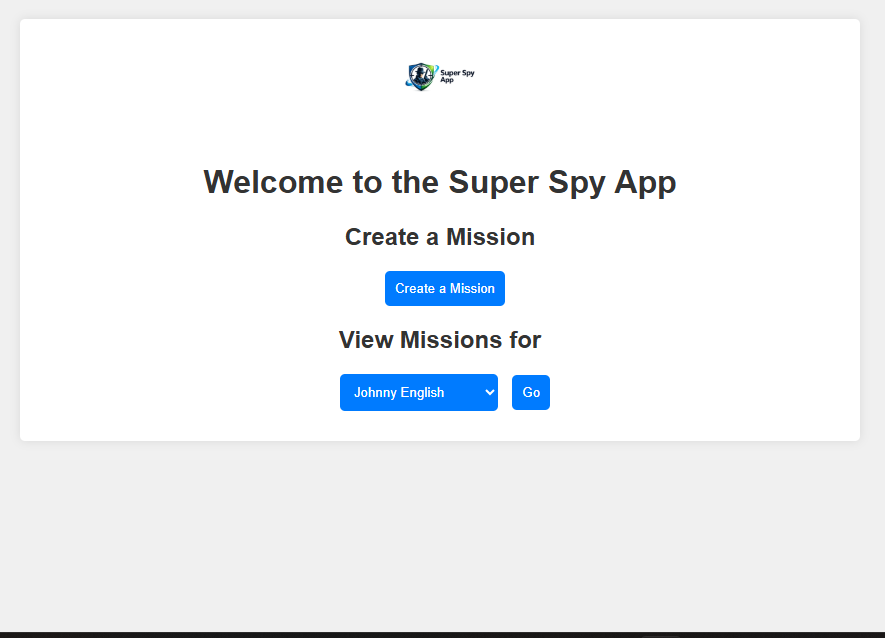

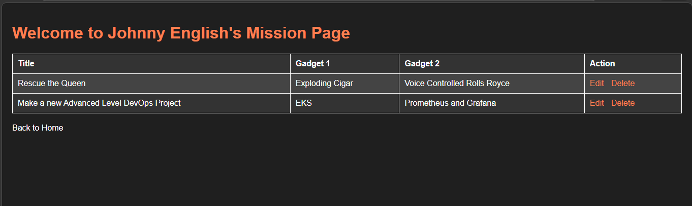

Nexus

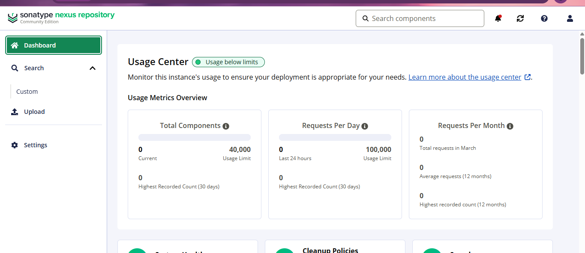

---

🚀 Commands

Create cluster

eksctl create cluster

Create nodegroup

eksctl create nodegroup

Check nodes

kubectl get nodes

Install monitoring

helm install monitoring prometheus-community/kube-prometheus-stack -n monitoring

---

✅ Features

✔ Automated CI/CD

✔ Code Quality Check

✔ Security Scan

✔ Docker Build

✔ Kubernetes Deploy

✔ AWS EKS

✔ Monitoring Dashboard

✔ LoadBalancer Access

✔ Production Architecture

---

👨‍💻 Author

Faizan

DevOps Engineer

AWS • Kubernetes • Jenkins • Docker • Monitoring

---

<h1 align="center">🚀 End-to-End DevOps CI/CD Pipeline on AWS EKS</h1>

<p align="center">
Production-Grade DevOps Project with Jenkins • SonarQube • Trivy • Docker • Kubernetes • Prometheus • Grafana
</p>

<p align="center">


</p>

---

## 📌 Overview

This project demonstrates a **Production-Grade End-to-End DevOps CI/CD Pipeline** deployed on AWS using EKS.

Pipeline includes:

✔ Jenkins CI/CD
✔ SonarQube Quality Gate
✔ Trivy Security Scan
✔ Docker Build & Push
✔ Kubernetes Deployment
✔ AWS EKS Cluster
✔ Prometheus + Grafana Monitoring
✔ LoadBalancer Service

---

## 🧠 Architecture


Flow:

GitHub → Jenkins → Maven → SonarQube → Trivy → Docker → DockerHub → EKS → LoadBalancer → User
↓
Prometheus + Grafana

---

## ⚙️ Tech Stack

| Category        | Tools               |
| --------------- | ------------------- |
| Cloud           | AWS EC2, AWS EKS    |
| CI/CD           | Jenkins             |
| Build           | Maven               |
| Code Quality    | SonarQube           |
| Security        | Trivy               |
| Container       | Docker              |
| Registry        | DockerHub           |
| Orchestration   | Kubernetes          |
| Monitoring      | Prometheus, Grafana |
| Package Manager | Helm                |

---

## 🔁 Jenkins Pipeline

1. Git Checkout
2. Compile
3. Test
4. Trivy Scan
5. SonarQube Scan
6. Quality Gate
7. Package
8. Docker Build
9. Docker Push
10. Deploy

---

## ☁️ AWS Infrastructure

* EC2 → Jenkins / Sonar / Nexus / Monitoring
* EKS Cluster
* NodeGroup
* LoadBalancer Service
* Security Groups

---

## 🐳 Docker Image

faizanab/mission:latest

DockerHub:

https://hub.docker.com/r/faizanab/mission

---

## 📊 Monitoring

Installed using Helm

helm install monitoring prometheus-community/kube-prometheus-stack -n monitoring

Dashboards:

* Node Exporter
* Kubernetes Workload
* Prometheus Overview

---

## 📂 Project Structure

.
├── Jenkinsfile
├── Dockerfile
├── k8s/
├── docs/
│   └── architecture.png
├── screenshots/
│   ├── jenkins.png
│   ├── sonar.png
│   ├── trivy.png
│   ├── dockerhub.png
│   ├── nodes.png
│   ├── pods.png
│   ├── Service-LoadBalancer.png
│   ├── grafana-nodes.png
│   ├── grafana-workload.png
│   ├── app.png
│   └── nexus.png
└── README.md

---

## 📸 Screenshots

### Jenkins Pipeline


### SonarQube


### Trivy Scan


### DockerHub


### EKS Nodes


### Kubernetes Pods


### LoadBalancer Service


### Grafana Nodes Dashboard


### Grafana Workload Dashboard


### Application Running


### Nexus


---

## 🚀 Commands

eksctl create cluster

kubectl get nodes

helm install monitoring prometheus-community/kube-prometheus-stack -n monitoring

kubectl get svc

---

## ✅ Features

✔ Automated CI/CD
✔ Code Quality Check
✔ Security Scan
✔ Docker Build
✔ AWS EKS Deploy
✔ Monitoring Dashboard
✔ LoadBalancer Access
✔ Production Architecture

---

## 👨‍💻 Author

Faizan
DevOps Engineer
AWS • Kubernetes • Jenkins • Docker • Monitoring

---
